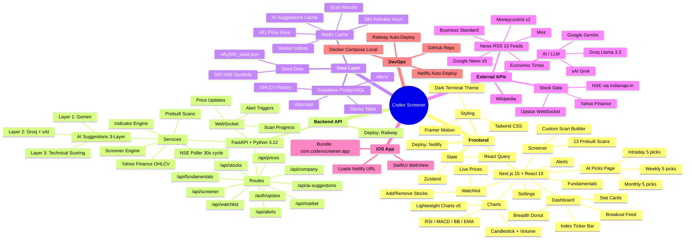
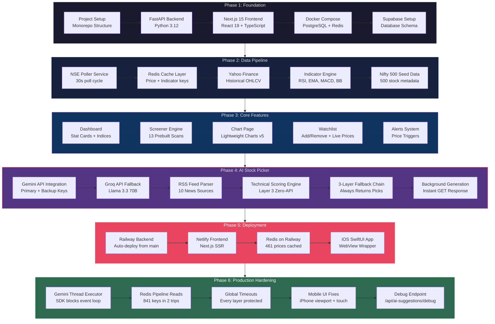
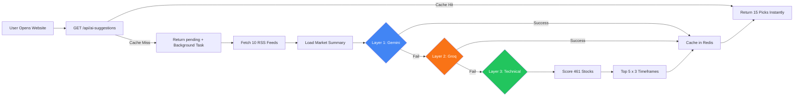
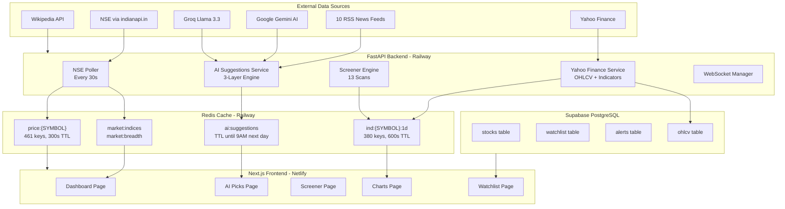

# Codex Screener — Interactive Mind Map & Workflow (for Figma)

> **How to import into Figma**: Copy each Mermaid code block into [Mermaid Chart Figma Plugin](https://www.figma.com/community/plugin/1365764431157) or use the live edit links below to export as SVG/PNG and paste into FigJam.

---

## 1. Project Architecture Mind Map

---

## 2. Project Build Workflow (Step-by-Step Phases)

---

## 3. AI Stock Picker — 3-Layer Fallback Flow

---

## 4. Data Flow Architecture

---

## How to Use in Figma

### Option 1: Mermaid Chart Plugin (Recommended)
1. Install [Mermaid Chart Plugin](https://www.figma.com/community/plugin/1365764431157) in Figma
2. Open plugin → paste any Mermaid code block above
3. Click "Render" → diagram appears as editable Figma shapes

### Option 2: SVG Import
1. Visit [Mermaid Live Editor](https://mermaid.live)
2. Paste any code block above
3. Download as SVG
4. Import SVG into Figma → all shapes are editable

### Option 3: FigJam
1. Open FigJam (Figma's whiteboard tool)
2. Use the Mermaid plugin or paste SVG exports
3. Add sticky notes, arrows, and annotations

---

**Created**: March 15, 2026
**Tool**: Claude Code + Mermaid.js
